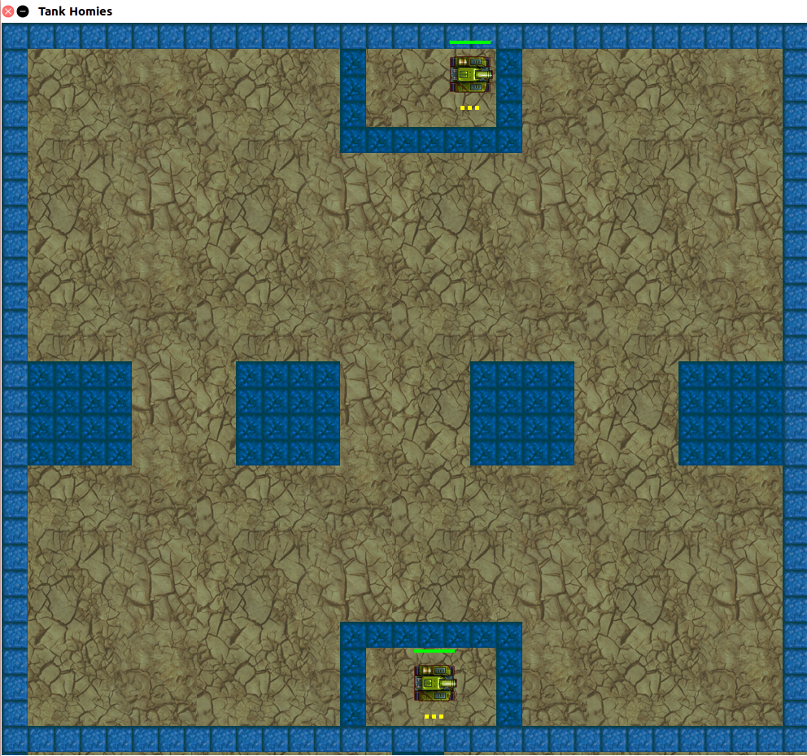

# Tank Wars
Tank wars is 2-player game where each player controls a single tank. Each player has 3 lives and full health at the start of the game. Players can deal damage to each other by firing bullets into the opposing tank. When enough damage is dealt and the player's life bar is depleted, they will respawn on the map with one less life and full health. The objective is to be the last tank standing. A winner's screen displays once one player is eliminated (they run out of lives) and the game ends.

## Controls
Player One's Controls: 
  - w : move forward
  - a : rotate counterclockwise 
  - d : rotate clockwise
  - s : move backward
  - f : fire bullets 

Player Two's Controls:
  - i : move forward
  - j : rotate clockwise
  - k : move backwards
  - l : rotate counterclockwise 
  - h : fire bullets 

## Installing 
All you need to have installed to run this program is [Java](https://www.java.com/en/download/help/download_options.xml).

## Running The Program 
Option 1:

You can run the game just by running the TankWars.jar file located in the src folder
    
    - Clone the repository 
    - Navigate into the src folder 
    - java -jar TankWars.jar

Option 2: 

Create your own jar file

  - Clone the repository 
  - cd into src
  - find -name "*.java" > sources.txt
  - javac @sources.txt
  - echo "Main-Class: application.Main" >> MANIFEST.MF
  - jar cfvm TankWarsGame.jar MANIFEST.MF .
  - java -jar TankWarsGame.jar

On success, this window should pop up, and you're ready to play! 

## Design Patterns
- Model View Controller
- Observer/Observable

## Built With 
- [Java.awt](https://docs.oracle.com/javase/7/docs/api/java/awt/package-summary.html) : We utilized this in order to use the MVC pattern (key events, key listeners, etc.)
- [Javax.swing](https://docs.oracle.com/javase/7/docs/api/javax/swing/package-summary.html) : We used this to work with Jframes and Jpanels and to aid with painting graphics onto the panel.
- [Javax.imageio](https://docs.oracle.com/javase/7/docs/api/javax/imageio/package-summary.html) : This was used to get our sprites into the game.

## Authors
- Gerren Penaloza
- Satjit Bola

